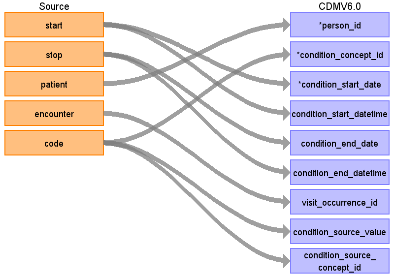

# Condition_occurrence

## Reading from Synthea table conditions.csv

| Destination Field | Source field | Logic | Comment field |
| --- | --- | --- | --- |
| condition_occurrence_id |  |Autogenerate  |  |
| person_id | patient | Map by mapping person.person_source_value to patient.  Find person.person_id by mapping encouters.patient to person.person_source_value. |  |
| condition_concept_id | code | Use code to lookup target_concept_id in CTE_TARGET_VOCAB_MAP:    select ctvm.target_concept_id    from conditions c     join cte_target_vocab_map ctvm       on ctvm.source_code              = c.code     and ctvm.target_domain_id       = 'Condition'     and ctvm.target_vocabulary_id = 'SNOMED' |  |
| condition_start_date | start |  |  |
| condition_start_datetime | start |  |  |
| condition_end_date | stop |  |  |
| condition_end_datetime | stop |  |  |
| condition_type_concept_id |32020  |Set to 32020 (EHR Encounter Diagnosis) for all records | |
| stop_reason |  |  |  |
| provider_id |  |  |  |
| visit_occurrence_id | encounter | Lookup visit_occurrence_id using encounter, joining to temp table defined in AllVisitTable.sql. |  |
| visit_detail_id |  |  |  |
| condition_source_value | code |  |  |
| condition_source_concept_id | code | Use code to lookup source_concept_id in CTE_SOURCE_VOCAB_MAP:     select csvm.source_concept_id     from cte_source_vocab_map csvm      join conditions c        on csvm.source_code                 = c.code      and csvm.source_vocabulary_id  = 'SNOMED' |  |
| condition_status_source_value |  |  |  |
| condition_status_concept_id |  |  |  |
