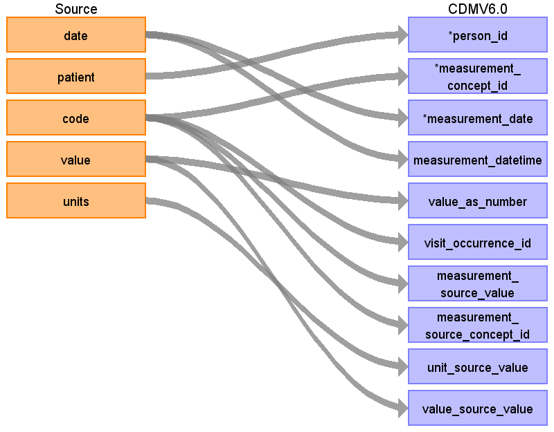
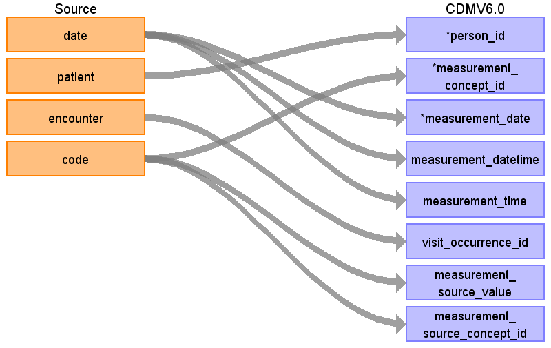

# Measurement

## Reading from procedures.csv

| Destination Field | Source field | Logic | Comment field |
| --- | --- | --- | --- |
| measurement_id |  |  |  |
| person_id | patient | Lookup in the person table: map by mapping person.person_source_value to patient. |  |
| measurement_concept_id | code | Use code to lookup target_concept_id in CTE_TARGET_VOCAB_MAP:    select ctvm.target_concept_id    from procedures pr     join cte_target_vocab_map ctvm       on ctvm.source_code              = pr.code     and ctvm.target_domain_id       = 'Measurement'     and ctvm.target_vocabulary_id = 'SNOMED' |  |
| measurement_date | date |  |  |
| measurement_datetime | date |  |  |
| measurement_time | date |  |  |
| measurement_type_concept_id | encounter  patient | Join to encounters to lookup encounters.description (same method used to find condition_occurrence.condition_type_concept_id):    select case             when e.description in (  'Encounter for check up (procedure)',  'Encounter for symptom',  'Prenatal visit',  'Outpatient procedure',  'Patient encounter procedure',  'Consultation for treatment',  'Encounter for 'check-up'',  'Encounter for problem',  'Prenatal initial visit',  'Postnatal visit',  'Asthma follow-up',  'Drug addiction therapy',  'Death Certification',  'Domiciliary or rest home patient evaluation and management',  'Patient-initiated encounter',  'Allergic disorder initial assessment',  'Allergic disorder follow-up assessment',  'Drug rehabilitation and detoxification',  'Office Visit',  'Encounter Inpatient',  'Non-urgent orthopedic admission'  )            then 38000215              when e.description in (  'Emergency room admission',  'Obstetric emergency hospital admission',  'Emergency Room Admission',  'Emergency hospital admission for asthma',  'Admission to surgical department',  'Emergency Encounter',  Hospital admission',  'Admission to thoracic surgery department'  )            then 38000183    from     encounters e    join procedures p      on p.encounter = e.id    and p.patient      = e.patient  Join to encounters to lookup encounters.description (same method used to find condition_occurrence.condition_type_concept_id):    select case             when e.description in (  'Encounter for check up (procedure)',  'Encounter for symptom',  'Prenatal visit',  'Outpatient procedure',  'Patient encounter procedure',  'Consultation for treatment',  'Encounter for 'check-up'',  'Encounter for problem',  'Prenatal initial visit',  'Postnatal visit',  'Asthma follow-up',  'Drug addiction therapy',  'Death Certification',  'Domiciliary or rest home patient evaluation and management',  'Patient-initiated encounter',  'Allergic disorder initial assessment',  'Allergic disorder follow-up assessment',  'Drug rehabilitation and detoxification',  'Office Visit',  'Encounter Inpatient',  'Non-urgent orthopedic admission'  )            then 38000215              when e.description in (  'Emergency room admission',  'Obstetric emergency hospital admission',  'Emergency Room Admission',  'Emergency hospital admission for asthma',  'Admission to surgical department',  'Emergency Encounter',  Hospital admission',  'Admission to thoracic surgery department'  )            then 38000183    from     encounters e    join procedures p      on p.encounter = e.id    and p.patient      = e.patient |  |
| operator_concept_id |  |  |  |
| value_as_number |  |  |  |
| value_as_concept_id |  |  |  |
| unit_concept_id |  |  |  |
| range_low |  |  |  |
| range_high |  |  |  |
| provider_id |  |  |  |
| visit_occurrence_id | encounter | Lookup visit_occurrence_id using encounter, joining to temp table defined in AllVisitTable.sql. |  |
| visit_detail_id |  |  |  |
| measurement_source_value | code |  |  |
| measurement_source_concept_id | code | Use code to lookup source_concept_id in CTE_SOURCE_VOCAB_MAP:     select csvm.source_concept_id     from cte_source_vocab_map csvm      join procedures pr        on csvm.source_code                 = pr.code      and csvm.target_domain_id          = 'Measurement'       and csvm.source_vocabulary_id  = 'SNOMED'      and csvm.target_vocabulary_id    = 'SNOMED' |  |
| unit_source_value |  |  |  |
| value_source_value |  |  |  |

## Reading from observations.csv

| Destination Field | Source field | Logic | Comment field |
| --- | --- | --- | --- |
| measurement_id |  |  |  |
| person_id | patient | Map by mapping person.person_source_value to patient.  Find person.person_id by mapping encouters.patient to person.person_source_value. |  |
| measurement_concept_id | code | Use code to lookup target_concept_id in CTE_TARGET_VOCAB_MAP:    select ctvm.target_concept_id    from observations o     join cte_target_vocab_map ctvm       on ctvm.source_code              = o.code     and ctvm.target_domain_id       = 'Measurement'     and ctvm.target_vocabulary_id = 'SNOMED' |  |
| measurement_date | date |  |  |
| measurement_datetime | date |  |  |
| measurement_time |  |  |  |
| measurement_type_concept_id |  |  |  |
| operator_concept_id |  |  |  |
| value_as_number | value |  |  |
| value_as_concept_id |  |  |  |
| unit_concept_id |  |  |  |
| range_low |  |  |  |
| range_high |  |  |  |
| provider_id |  |  |  |
| visit_occurrence_id | code | Lookup visit_occurrence_id using encounter, joining to temp table defined in AllVisitTable.sql. |  |
| visit_detail_id |  |  |  |
| measurement_source_value | code |  |  |
| measurement_source_concept_id | code | Use code to lookup source_concept_id in CTE_SOURCE_VOCAB_MAP:     select csvm.source_concept_id     from cte_source_vocab_map csvm      join observations o        on csvm.source_code                 = o.code      and csvm.source_vocabulary_id  = 'SNOMED' |  |
| unit_source_value | units |  |  |
| value_source_value | value |  |  |
