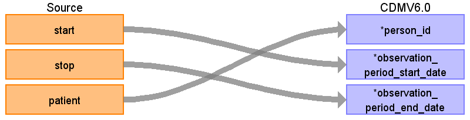

# Observation_period

## Reading from Synthea table encounters.csv

| Destination Field | Source field | Logic | Comment field |
| --- | --- | --- | --- |
| observation_period_id |  |Autogenerate  |  |
| person_id | patient | Lookup up PERSON_ID in the PERSON table by mapping patient to PERSON_SOURCE_VALUE |  |
| observation_period_start_date | start | Take the earliest START per patient |  |
| observation_period_end_date | stop | Take the latest STOP per patient |  |
| period_type_concept_id | 44814724 | Set as this concept for all records  |  |
