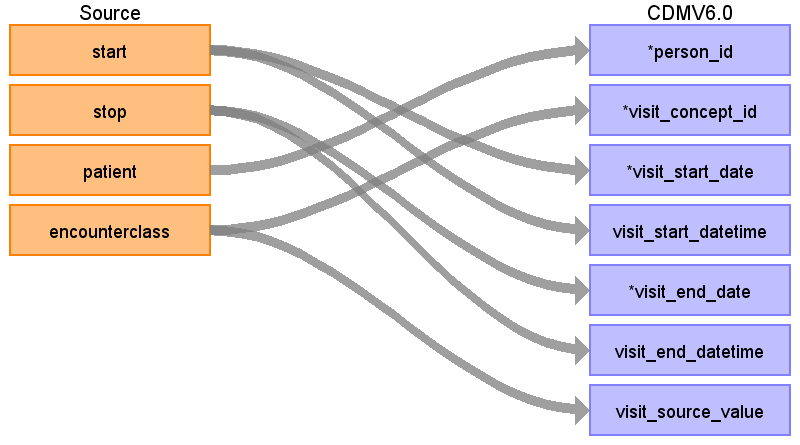

# Visit_occurrence

## Reading from Synthea table encounters.csv

### STEP 1 
For encounterclass = ‘Inpatient’ (IP):
1. Sort data in ascending order by PATIENT, START, END.
2. Then by PERSON_ID, collapse lines of claim as long as the time between the END of one line and the START of the next is <=1 day.
3. Each consolidated inpatient claim is then considered as one inpatient visit, set 
    1. MIN(START) as VISIT_START_DATE
    2. MAX(END) as VISIT_END_DATE
    3. ‘IP’ as PLACE_OF_SERVICE_SOURCE_VALUE
    4. See if any records with encounterclass ‘outpatient’ (OP), 'ambulatory' (OP), 'wellness' (OP), ‘emergency’ (ER) or 'urgentcare' (ER) occur during an identified ‘inpatient’ visit. These should be consolidated into the ‘inpatient’ visit, unless it is an ‘emergency’ or 'urgentcare' visit that starts and ends on the first day of the ‘inpatient’ visit.  Types of outpatient (OP) visits not collapsed: 
        1. If an OP starts before an IP but ends during an IP
        2. If an OP starts before and ends after an IP visit.  If an OP is collapsed into an IP and its VISIT_END_DATE is greater than the IP's VISIT_END_DATE it does not change the IP VISIT_END_DATE.

For claim type in ('emergency','urgentcare') (ER)
1. Sort data in ascending order by PATIENT, START, END.
2. Then by PERSON_ID, collapse all (ER) claims that start on the same day as one ER visit, then take START as VISIT_START_DATE, MAX (END) as VISIT_END_DATE, and ‘ER’ as PLACE_OF_SERVICE_SOURCE_VALUE.

For claim type in ('ambulatory', 'wellness', 'outpatient') (OP)
1. Sort data in ascending order by PATIENT, START, END.
2. Then by PERSON_ID take START as VISIT_START_DATE, MAX(END) as VISIT_END_DATE, and ‘OP’ as PLACE_OF_SERVICE_SOURCE_VALUE.

Use logic found here:
https://github.com/OHDSI/ETL-Synthea/blob/master/ETL/SQL/AllVisitTable.sql

| Destination Field | Source field | Logic | Comment field |
| --- | --- | --- | --- |
| visit_occurrence_id |  |Autogenerate  |  |
| person_id | patient | Map by mapping person.person_source_value to patient.  Find person.person_id by mapping encouters.patient to person.person_source_value. |  |
| visit_concept_id | encounterclass | case   when lower(encouterclass) = 'ambulatory' then 9202  when lower(encouterclass) = 'emergency' then 9203  when lower(encouterclass) = 'inpatient'     then 9201  when lower(encouterclass) = 'wellness'     then 9202  when lower(encouterclass) = 'urgentcare'  then 9203   when lower(encouterclass) = 'outpatient'   then 9202  else 0  end |  |
| visit_start_date | start |  |  |
| visit_start_datetime | start |  |  |
| visit_end_date | stop |  |  |
| visit_end_datetime | stop |  |  |
| visit_type_concept_id |  |  |  |
| provider_id |  |  |  |
| care_site_id |  |  |  |
| visit_source_value | encounterclass |  |  |
| visit_source_concept_id |  |  |  |
| admitting_source_concept_id |  |  |  |
| admitting_source_value |  |  |  |
| discharge_to_concept_id |  |  |  |
| discharge_to_source_value |  |  |  |
| preceding_visit_occurrence_id |  |  |  |
