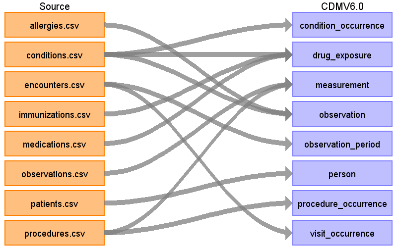
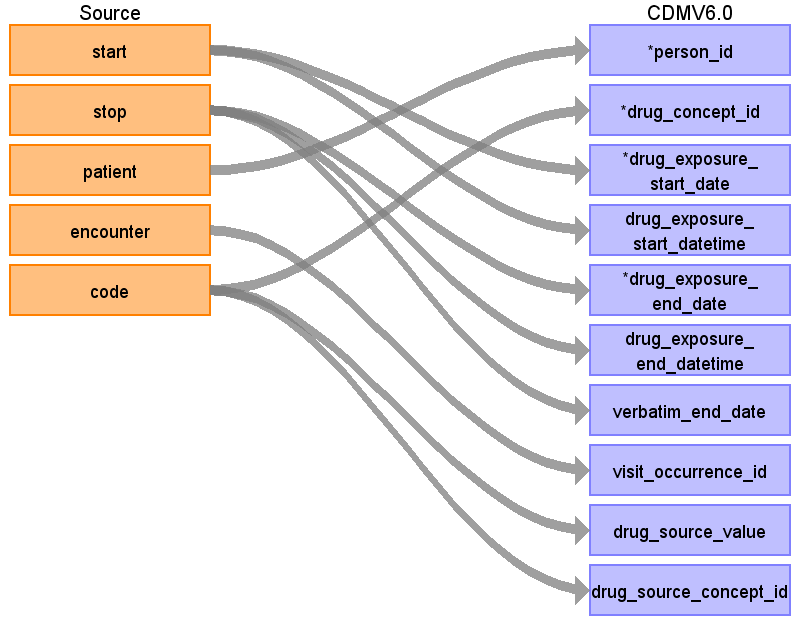
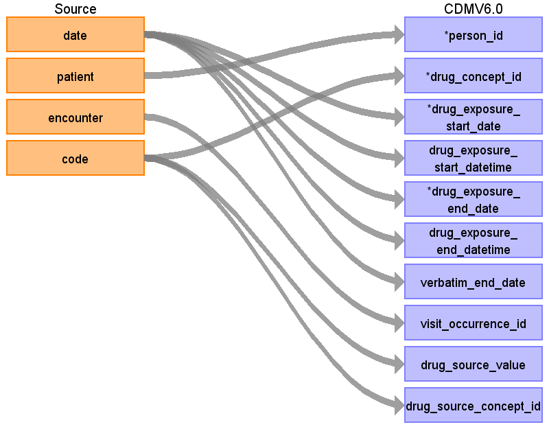
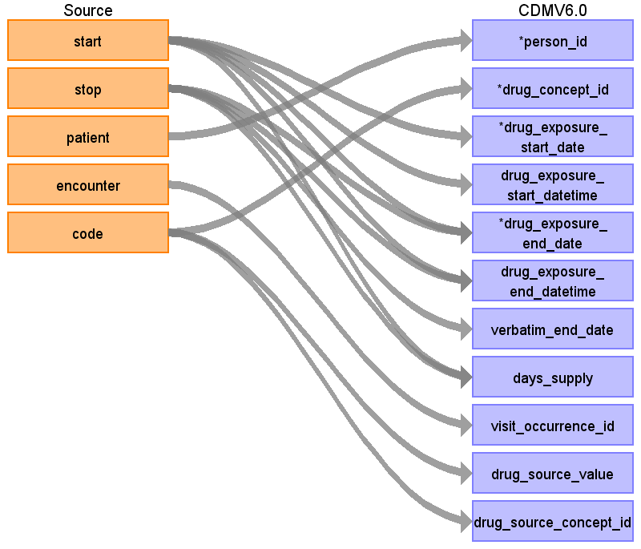
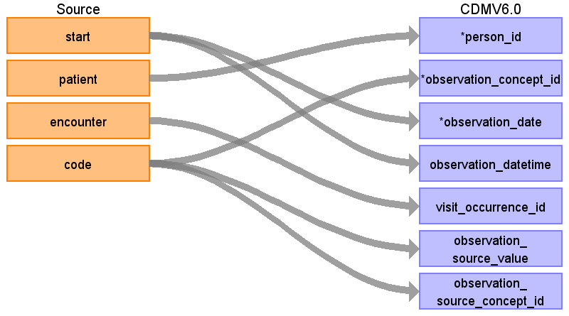
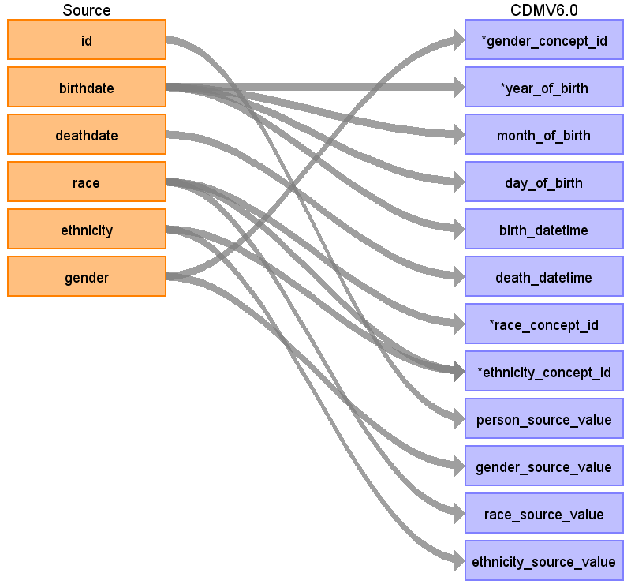
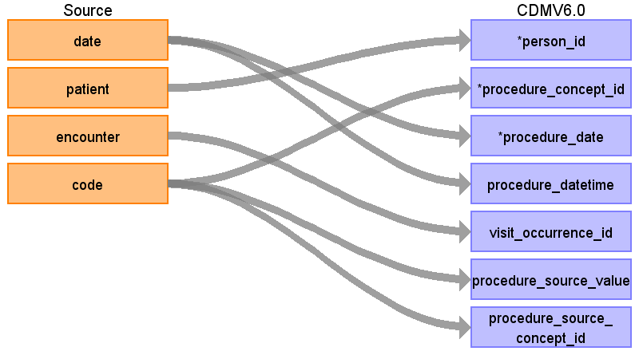

# Source Data Mapping Approach to CDMV5.3.1

## Table name: condition_occurrence

### Reading from conditions.csv

| Destination Field | Source field | Logic | Comment field |
| --- | --- | --- | --- |
| condition_occurrence_id |  |  |  |
| person_id | patient | Map by mapping person.person_source_value to patient.  Find person.person_id by mapping encouters.patient to person.person_source_value. |  |
| condition_concept_id | code | Use code to lookup target_concept_id in CTE_TARGET_VOCAB_MAP:    select ctvm.target_concept_id    from conditions c     join cte_target_vocab_map ctvm       on ctvm.source_code              = c.code     and ctvm.target_domain_id       = 'Condition'     and ctvm.target_vocabulary_id = 'SNOMED' |  |
| condition_start_date | start |  |  |
| condition_start_datetime | start |  |  |
| condition_end_date | stop |  |  |
| condition_end_datetime | stop |  |  |
| condition_type_concept_id |  |  |  |
| stop_reason |  |  |  |
| provider_id |  |  |  |
| visit_occurrence_id | encounter | Lookup visit_occurrence_id using encounter, joining to temp table defined in AllVisitTable.sql. |  |
| visit_detail_id |  |  |  |
| condition_source_value | code |  |  |
| condition_source_concept_id | code | Use code to lookup source_concept_id in CTE_SOURCE_VOCAB_MAP:     select csvm.source_concept_id     from cte_source_vocab_map csvm      join conditions c        on csvm.source_code                 = c.code      and csvm.source_vocabulary_id  = 'SNOMED' |  |
| condition_status_source_value |  |  |  |
| condition_status_concept_id |  |  |  |

## Table name: death

## Table name: device_exposure

## Table name: drug_exposure

### Reading from conditions.csv

| Destination Field | Source field | Logic | Comment field |
| --- | --- | --- | --- |
| drug_exposure_id |  |  |  |
| person_id | patient | Map by mapping person.person_source_value to patient.  Find person.person_id by mapping encouters.patient to person.person_source_value. |  |
| drug_concept_id | code | Use code to lookup target_concept_id in CTE_TARGET_VOCAB_MAP:    select ctvm.target_concept_id    from conditions c     join cte_target_vocab_map ctvm       on ctvm.source_code              = c.code     and ctvm.target_domain_id       = 'Drug'     and ctvm.target_vocabulary_id = 'RxNorm' |  |
| drug_exposure_start_date | start |  |  |
| drug_exposure_start_datetime | start |  |  |
| drug_exposure_end_date | stop |  |  |
| drug_exposure_end_datetime | stop |  |  |
| verbatim_end_date | stop |  |  |
| drug_type_concept_id |  |  |  |
| stop_reason |  |  |  |
| refills |  |  |  |
| quantity |  |  |  |
| days_supply |  |  |  |
| sig |  |  |  |
| route_concept_id |  |  |  |
| lot_number |  |  |  |
| provider_id |  |  |  |
| visit_occurrence_id | encounter | Lookup visit_occurrence_id using encounter, joining to temp table defined in AllVisitTable.sql. |  |
| visit_detail_id |  |  |  |
| drug_source_value | code |  |  |
| drug_source_concept_id | code | Use code to lookup source_concept_id in CTE_SOURCE_VOCAB_MAP:     select csvm.source_concept_id     from cte_source_vocab_map csvm      join conditions c        on csvm.source_code                 = c.code      and csvm.source_vocabulary_id  = 'RxNorm' |  |
| route_source_value |  |  |  |
| dose_unit_source_value |  |  |  |

### Reading from medications.csv

| Destination Field | Source field | Logic | Comment field |
| --- | --- | --- | --- |
| drug_exposure_id |  |  |  |
| person_id | patient | Map by mapping person.person_source_value to patient.  Find person.person_id by mapping encouters.patient to person.person_source_value. |  |
| drug_concept_id | code | Use code to lookup target_concept_id in CTE_TARGET_VOCAB_MAP:    select ctvm.target_concept_id    from medications m     join cte_target_vocab_map ctvm       on ctvm.source_code               = m.code     and ctvm.target_domain_id        = 'Drug'     and ctvm.target_vocabulary_id  = 'RxNorm' |  |
| drug_exposure_start_date | start |  |  |
| drug_exposure_start_datetime | start |  |  |
| drug_exposure_end_date | stop |  |  |
| drug_exposure_end_datetime | stop |  |  |
| verbatim_end_date |  |  |  |
| drug_type_concept_id |  |  |  |
| stop_reason |  |  |  |
| refills |  |  |  |
| quantity |  |  |  |
| days_supply | start  stop |  |  |
| sig |  |  |  |
| route_concept_id |  |  |  |
| lot_number |  |  |  |
| provider_id |  |  |  |
| visit_occurrence_id | encounter | Lookup visit_occurrence_id using encounter, joining to temp table defined in AllVisitTable.sql. |  |
| visit_detail_id |  |  |  |
| drug_source_value | code |  |  |
| drug_source_concept_id | code | Use code to lookup target_concept_id in CTE_SOURCE_VOCAB_MAP:    select csvm.source_concept_id    from medications m     join cte_source_vocab_map csvm      on cvm.source_code                = m.code     and cvm.source_vocabulary_id = 'RxNorm' |  |
| route_source_value |  |  |  |
| dose_unit_source_value |  |  |  |

### Reading from immunizations.csv

| Destination Field | Source field | Logic | Comment field |
| --- | --- | --- | --- |
| drug_exposure_id |  |  |  |
| person_id | patient | Map by mapping person.person_source_value to patient.  Find person.person_id by mapping encouters.patient to person.person_source_value. |  |
| drug_concept_id | code | Use code to lookup target_concept_id in CTE_TARGET_VOCAB_MAP:    select ctvm.target_concept_id    from immunizations i     join cte_target_vocab_map ctvm       on ctvm.source_code               = i.code     and ctvm.target_domain_id        = 'Drug'     and ctvm.target_vocabulary_id = 'CVX' |  |
| drug_exposure_start_date | date |  |  |
| drug_exposure_start_datetime | date |  |  |
| drug_exposure_end_date | date |  |  |
| drug_exposure_end_datetime | date |  |  |
| verbatim_end_date | date |  |  |
| drug_type_concept_id |  |  |  |
| stop_reason |  |  |  |
| refills |  |  |  |
| quantity |  |  |  |
| days_supply |  |  |  |
| sig |  |  |  |
| route_concept_id |  |  |  |
| lot_number |  |  |  |
| provider_id |  |  |  |
| visit_occurrence_id | encounter | Lookup visit_occurrence_id using encounter, joining to temp table defined in AllVisitTable.sql. |  |
| visit_detail_id |  |  |  |
| drug_source_value | code |  |  |
| drug_source_concept_id | code | Use code to lookup target_concept_id in CTE_SOURCE_VOCAB_MAP:    select csvm.source_concept_id    from immunizations i     join cte_source_vocab_map csvm      on csvm.source_code                = i.code     and csvm.source_vocabulary_id = 'CVX' |  |
| route_source_value |  |  |  |
| dose_unit_source_value |  |  |  |

## Table name: fact_relationship

## Table name: measurement

### Reading from procedures.csv

| Destination Field | Source field | Logic | Comment field |
| --- | --- | --- | --- |
| measurement_id |  |  |  |
| person_id | patient | Lookup in the person table: map by mapping person.person_source_value to patient. |  |
| measurement_concept_id | code | Use code to lookup target_concept_id in CTE_TARGET_VOCAB_MAP:    select ctvm.target_concept_id    from procedures pr     join cte_target_vocab_map ctvm       on ctvm.source_code              = pr.code     and ctvm.target_domain_id       = 'Measurement'     and ctvm.target_vocabulary_id = 'SNOMED' |  |
| measurement_date | date |  |  |
| measurement_datetime | date |  |  |
| measurement_time | date |  |  |
| measurement_type_concept_id | encounter  patient | Join to encounters to lookup encounters.description (same method used to find condition_occurrence.condition_type_concept_id):    select case             when e.description in (  'Encounter for check up (procedure)',  'Encounter for symptom',  'Prenatal visit',  'Outpatient procedure',  'Patient encounter procedure',  'Consultation for treatment',  'Encounter for 'check-up'',  'Encounter for problem',  'Prenatal initial visit',  'Postnatal visit',  'Asthma follow-up',  'Drug addiction therapy',  'Death Certification',  'Domiciliary or rest home patient evaluation and management',  'Patient-initiated encounter',  'Allergic disorder initial assessment',  'Allergic disorder follow-up assessment',  'Drug rehabilitation and detoxification',  'Office Visit',  'Encounter Inpatient',  'Non-urgent orthopedic admission'  )            then 38000215              when e.description in (  'Emergency room admission',  'Obstetric emergency hospital admission',  'Emergency Room Admission',  'Emergency hospital admission for asthma',  'Admission to surgical department',  'Emergency Encounter',  Hospital admission',  'Admission to thoracic surgery department'  )            then 38000183    from     encounters e    join procedures p      on p.encounter = e.id    and p.patient      = e.patient  Join to encounters to lookup encounters.description (same method used to find condition_occurrence.condition_type_concept_id):    select case             when e.description in (  'Encounter for check up (procedure)',  'Encounter for symptom',  'Prenatal visit',  'Outpatient procedure',  'Patient encounter procedure',  'Consultation for treatment',  'Encounter for 'check-up'',  'Encounter for problem',  'Prenatal initial visit',  'Postnatal visit',  'Asthma follow-up',  'Drug addiction therapy',  'Death Certification',  'Domiciliary or rest home patient evaluation and management',  'Patient-initiated encounter',  'Allergic disorder initial assessment',  'Allergic disorder follow-up assessment',  'Drug rehabilitation and detoxification',  'Office Visit',  'Encounter Inpatient',  'Non-urgent orthopedic admission'  )            then 38000215              when e.description in (  'Emergency room admission',  'Obstetric emergency hospital admission',  'Emergency Room Admission',  'Emergency hospital admission for asthma',  'Admission to surgical department',  'Emergency Encounter',  Hospital admission',  'Admission to thoracic surgery department'  )            then 38000183    from     encounters e    join procedures p      on p.encounter = e.id    and p.patient      = e.patient |  |
| operator_concept_id |  |  |  |
| value_as_number |  |  |  |
| value_as_concept_id |  |  |  |
| unit_concept_id |  |  |  |
| range_low |  |  |  |
| range_high |  |  |  |
| provider_id |  |  |  |
| visit_occurrence_id | encounter | Lookup visit_occurrence_id using encounter, joining to temp table defined in AllVisitTable.sql. |  |
| visit_detail_id |  |  |  |
| measurement_source_value | code |  |  |
| measurement_source_concept_id | code | Use code to lookup source_concept_id in CTE_SOURCE_VOCAB_MAP:     select csvm.source_concept_id     from cte_source_vocab_map csvm      join procedures pr        on csvm.source_code                 = pr.code      and csvm.target_domain_id          = 'Measurement'       and csvm.source_vocabulary_id  = 'SNOMED'      and csvm.target_vocabulary_id    = 'SNOMED' |  |
| unit_source_value |  |  |  |
| value_source_value |  |  |  |

### Reading from observations.csv

| Destination Field | Source field | Logic | Comment field |
| --- | --- | --- | --- |
| measurement_id |  |  |  |
| person_id | patient | Map by mapping person.person_source_value to patient.  Find person.person_id by mapping encouters.patient to person.person_source_value. |  |
| measurement_concept_id | code | Use code to lookup target_concept_id in CTE_TARGET_VOCAB_MAP:    select ctvm.target_concept_id    from observations o     join cte_target_vocab_map ctvm       on ctvm.source_code              = o.code     and ctvm.target_domain_id       = 'Measurement'     and ctvm.target_vocabulary_id = 'SNOMED' |  |
| measurement_date | date |  |  |
| measurement_datetime | date |  |  |
| measurement_time |  |  |  |
| measurement_type_concept_id |  |  |  |
| operator_concept_id |  |  |  |
| value_as_number | value |  |  |
| value_as_concept_id |  |  |  |
| unit_concept_id |  |  |  |
| range_low |  |  |  |
| range_high |  |  |  |
| provider_id |  |  |  |
| visit_occurrence_id | code | Lookup visit_occurrence_id using encounter, joining to temp table defined in AllVisitTable.sql. |  |
| visit_detail_id |  |  |  |
| measurement_source_value | code |  |  |
| measurement_source_concept_id | code | Use code to lookup source_concept_id in CTE_SOURCE_VOCAB_MAP:     select csvm.source_concept_id     from cte_source_vocab_map csvm      join observations o        on csvm.source_code                 = o.code      and csvm.source_vocabulary_id  = 'SNOMED' |  |
| unit_source_value | units |  |  |
| value_source_value | value |  |  |

## Table name: note

## Table name: note_nlp

## Table name: observation

### Reading from allergies.csv

| Destination Field | Source field | Logic | Comment field |
| --- | --- | --- | --- |
| observation_id |  |  |  |
| person_id | patient | Map by mapping person.person_source_value to patient.  Find person.person_id by mapping encouters.patient to person.person_source_value. |  |
| observation_concept_id | code | Use code to lookup target_concept_id in CTE_TARGET_VOCAB_MAP:    select ctvm.target_concept_id    from allergies a     join cte_target_vocab_map ctvm       on ctvm.source_code              = a.code     and ctvm.target_domain_id       = 'Observation'     and ctvm.target_vocabulary_id = 'SNOMED' |  |
| observation_date | start |  |  |
| observation_datetime | start |  |  |
| observation_type_concept_id | encounter  patient | Join to encounters to lookup encounters.description:      select case             when e.description in (  'Encounter for check up (procedure)',  'Encounter for symptom',  'Prenatal visit',  'Outpatient procedure',  'Patient encounter procedure',  'Consultation for treatment',  'Encounter for 'check-up'',  'Encounter for problem',  'Prenatal initial visit',  'Postnatal visit',  'Asthma follow-up',  'Drug addiction therapy',  'Death Certification',  'Domiciliary or rest home patient evaluation and management',  'Patient-initiated encounter',  'Allergic disorder initial assessment',  'Allergic disorder follow-up assessment',  'Drug rehabilitation and detoxification',  'Office Visit',  'Encounter Inpatient',  'Non-urgent orthopedic admission'  )            then 38000215              when e.description in (  'Emergency room admission',  'Obstetric emergency hospital admission',  'Emergency Room Admission',  'Emergency hospital admission for asthma',  'Admission to surgical department',  'Emergency Encounter',  Hospital admission',  'Admission to thoracic surgery department'  )            then 38000183    from     encounters e    join allergies a      on a.encounter = e.id    and a.patient      = e.patient  Join to encounters to lookup encounters.description:      select case             when e.description in (  'Encounter for check up (procedure)',  'Encounter for symptom',  'Prenatal visit',  'Outpatient procedure',  'Patient encounter procedure',  'Consultation for treatment',  'Encounter for 'check-up'',  'Encounter for problem',  'Prenatal initial visit',  'Postnatal visit',  'Asthma follow-up',  'Drug addiction therapy',  'Death Certification',  'Domiciliary or rest home patient evaluation and management',  'Patient-initiated encounter',  'Allergic disorder initial assessment',  'Allergic disorder follow-up assessment',  'Drug rehabilitation and detoxification',  'Office Visit',  'Encounter Inpatient',  'Non-urgent orthopedic admission'  )            then 38000215              when e.description in (  'Emergency room admission',  'Obstetric emergency hospital admission',  'Emergency Room Admission',  'Emergency hospital admission for asthma',  'Admission to surgical department',  'Emergency Encounter',  Hospital admission',  'Admission to thoracic surgery department'  )            then 38000183    from     encounters e    join allergies a      on a.encounter = e.id    and a.patient      = e.patient |  |
| value_as_number |  |  |  |
| value_as_string |  |  |  |
| value_as_concept_id |  |  |  |
| qualifier_concept_id |  |  |  |
| unit_concept_id |  |  |  |
| provider_id |  |  |  |
| visit_occurrence_id | encounter | Lookup visit_occurrence_id using encounter, joining to temp table defined in AllVisitTable.sql. |  |
| visit_detail_id |  |  |  |
| observation_source_value | code |  |  |
| observation_source_concept_id | code | Use code to lookup source_concept_id in CTE_SOURCE_VOCAB_MAP:     select csvm.source_concept_id     from cte_source_vocab_map csvm      join allergies a        on csvm.source_code                 = a.code      and csvm.source_vocabulary_id  = 'SNOMED' |  |
| unit_source_value |  |  |  |
| qualifier_source_value |  |  |  |

### Reading from conditions.csv

| Destination Field | Source field | Logic | Comment field |
| --- | --- | --- | --- |
| observation_id |  |  |  |
| person_id | patient | Map by mapping person.person_source_value to patient.  Find person.person_id by mapping encouters.patient to person.person_source_value. |  |
| observation_concept_id | code | Use code to lookup target_concept_id in CTE_TARGET_VOCAB_MAP:    select ctvm.target_concept_id    from conditions c     join cte_target_vocab_map ctvm       on ctvm.source_code              = c.code     and ctvm.target_domain_id       = 'Observation'     and ctvm.target_vocabulary_id = 'SNOMED' |  |
| observation_date | start |  |  |
| observation_datetime | start |  |  |
| observation_type_concept_id | encounter  patient | Join to encounters to lookup encounters.description:      select case             when e.description in (  'Encounter for check up (procedure)',  'Encounter for symptom',  'Prenatal visit',  'Outpatient procedure',  'Patient encounter procedure',  'Consultation for treatment',  'Encounter for 'check-up'',  'Encounter for problem',  'Prenatal initial visit',  'Postnatal visit',  'Asthma follow-up',  'Drug addiction therapy',  'Death Certification',  'Domiciliary or rest home patient evaluation and management',  'Patient-initiated encounter',  'Allergic disorder initial assessment',  'Allergic disorder follow-up assessment',  'Drug rehabilitation and detoxification',  'Office Visit',  'Encounter Inpatient',  'Non-urgent orthopedic admission'  )            then 38000215              when e.description in (  'Emergency room admission',  'Obstetric emergency hospital admission',  'Emergency Room Admission',  'Emergency hospital admission for asthma',  'Admission to surgical department',  'Emergency Encounter',  Hospital admission',  'Admission to thoracic surgery department'  )            then 38000183    from     encounters e    join condition c      on c.encounter = e.id    and c.patient      = e.patient  Join to encounters to lookup encounters.description:      select case             when e.description in (  'Encounter for check up (procedure)',  'Encounter for symptom',  'Prenatal visit',  'Outpatient procedure',  'Patient encounter procedure',  'Consultation for treatment',  'Encounter for 'check-up'',  'Encounter for problem',  'Prenatal initial visit',  'Postnatal visit',  'Asthma follow-up',  'Drug addiction therapy',  'Death Certification',  'Domiciliary or rest home patient evaluation and management',  'Patient-initiated encounter',  'Allergic disorder initial assessment',  'Allergic disorder follow-up assessment',  'Drug rehabilitation and detoxification',  'Office Visit',  'Encounter Inpatient',  'Non-urgent orthopedic admission'  )            then 38000215              when e.description in (  'Emergency room admission',  'Obstetric emergency hospital admission',  'Emergency Room Admission',  'Emergency hospital admission for asthma',  'Admission to surgical department',  'Emergency Encounter',  Hospital admission',  'Admission to thoracic surgery department'  )            then 38000183    from     encounters e    join condition c      on c.encounter = e.id    and c.patient      = e.patient |  |
| value_as_number |  |  |  |
| value_as_string |  |  |  |
| value_as_concept_id |  |  |  |
| qualifier_concept_id |  |  |  |
| unit_concept_id |  |  |  |
| provider_id |  |  |  |
| visit_occurrence_id | encounter | Lookup visit_occurrence_id using encounter, joining to temp table defined in AllVisitTable.sql. |  |
| visit_detail_id |  |  |  |
| observation_source_value | code |  |  |
| observation_source_concept_id | code | Use code to lookup source_concept_id in CTE_SOURCE_VOCAB_MAP:     select csvm.source_concept_id     from cte_source_vocab_map csvm      join conditions c        on csvm.source_code                 = c.code      and csvm.source_vocabulary_id  = 'SNOMED' |  |
| unit_source_value |  |  |  |
| qualifier_source_value |  |  |  |

## Table name: observation_period

### Reading from encounters.csv

| Destination Field | Source field | Logic | Comment field |
| --- | --- | --- | --- |
| observation_period_id |  |  |  |
| person_id | patient | Map by mapping person.person_source_value to patient.  Find person.person_id by mapping encouters.patient to person.person_source_value. |  |
| observation_period_start_date | start | min(start) group by patient  Take the earliest START per patient |  |
| observation_period_end_date | stop | max(stop) group by patient  Take the latest STOP per patient |  |
| period_type_concept_id |  |  |  |

## Table name: person

### Reading from patients.csv

| Destination Field | Source field | Logic | Comment field |
| --- | --- | --- | --- |
| person_id |  |  |  |
| gender_concept_id | gender | case upper(p.gender)          when 'M' then 8507          when 'F' then 8532  end | Please drop rows with missing/unknown gender. |
| year_of_birth | birthdate | Take Year from birthdate |  |
| month_of_birth | birthdate | Take month from birthdate |  |
| day_of_birth | birthdate | Take day from birthdate |  |
| birth_datetime | birthdate | With midnight as time 00:00:00 |  |
| race_concept_id | race | case upper(race)   	when 'WHITE' then 8527   	when 'BLACK' then 8516   	when 'ASIAN'  then 8515   	else 0   end |  |
| ethnicity_concept_id | race  ethnicity | case when upper(race) in ('HISPANIC') then 38003563 else 0 end  case when upper(ethnicity) in (  'CENTRAL_AMERICAN',   'DOMINICAN',   'MEXICAN',   'PUERTO_RICAN',   'SOUTH_AMERICAN'  ) or upper(race) = 'HISPANIC'  then 38003563 else 0   end |  |
| location_id |  |  |  |
| provider_id |  |  |  |
| care_site_id |  |  |  |
| person_source_value | id |  |  |
| gender_source_value | gender |  |  |
| gender_source_concept_id |  |  |  |
| race_source_value | race |  |  |
| race_source_concept_id |  |  |  |
| ethnicity_source_value | ethnicity |  |  |
| ethnicity_source_concept_id |  |  |  |

## Table name: procedure_occurrence

### Reading from procedures.csv

| Destination Field | Source field | Logic | Comment field |
| --- | --- | --- | --- |
| procedure_occurrence_id |  |  |  |
| person_id | patient | Map by mapping person.person_source_value to patient.  Find person.person_id by mapping encouters.patient to person.person_source_value. |  |
| procedure_concept_id | code | Use code to lookup target_concept_id in CTE_TARGET_VOCAB_MAP:    select ctvm.target_concept_id    from procedures pr     join cte_target_vocab_map ctvm       on ctvm.source_code              = pr.code     and ctvm.target_domain_id       = 'Procedure'     and ctvm.target_vocabulary_id = 'SNOMED' |  |
| procedure_date | date |  |  |
| procedure_datetime | date |  |  |
| procedure_type_concept_id |  |  |  |
| modifier_concept_id |  |  |  |
| quantity |  |  |  |
| provider_id |  |  |  |
| visit_occurrence_id | encounter | Lookup visit_occurrence_id using encounter, joining to temp table defined in AllVisitTable.sql. |  |
| visit_detail_id |  |  |  |
| procedure_source_value | code |  |  |
| procedure_source_concept_id | code | Use code to lookup source_concept_id in CTE_SOURCE_VOCAB_MAP:     select csvm.source_concept_id     from cte_source_vocab_map csvm      join procedures pr        on csvm.source_code                 = pr.code      and csvm.source_vocabulary_id  = 'SNOMED' |  |
| modifier_source_value |  |  |  |

## Table name: specimen

## Table name: visit_detail

## Table name: visit_occurrence

### Reading from encounters.csv

Use logic found here:
https://github.com/OHDSI/ETL-Synthea/blob/master/ETL/SQL/AllVisitTable.sql

PART 1 - Generate visits by:
-For claim type = ‘Inpatient’ (IP):
---Sort data in ascending order by PERSON_ID, VISIT_START_DATE, VISIT_END_DATE.
---Then by PERSON_ID, collapse lines of claim as long as the time between the VISIT_END_DATE of one line and the VISIT_START_DATE of the next is <=1.
---Then each consolidated inpatient claim is considered as one inpatient visit, set 
------MIN(VISIT_START_DATE) as VISIT_START_DATE
------MAX(VISIT_END_DATE) as VISIT_END_DATE
------‘IP’ as PLACE_OF_SERVICE_SOURCE_VALUE
---See if any ‘outpatient’ (OP) or ‘emergency’ (ER) or 'urgent' (ER) records occur during an ‘inpatient’ visit.  These should be consolidated into that ‘inpatient’ visit, unless it is an ‘emergency’ or 'urgent' visit that starts and ends on the first day of the ‘inpatient’ visit.  Types of outpatient (OP) visits not collapsed: [1] if an OP starts before an IP but ends during an IP or [2] if an OP starts before and ends after an IP visit.  If an OP is collapsed into an IP and its VISIT_END_DATE is greater than the IP's VISIT_END_DATE it does not change the IP VISIT_END_DATE.

-For claim type in ('emergency','urgent') (ER)
---Sort data in ascending order by PERSON_ID, VISIT_START_DATE, VISIT_END_DATE.
---Then by PERSON_ID, collapse all (ER) claims that start on the same day as one ER visit, then take VISIT_START_DATE as VISIT_START_DATE, MAX (VISIT_END_DATE) as VISIT_END_DATE, and ‘ER’ as PLACE_OF_SERVICE_SOURCE_VALUE.

-For claim type in ('ambulatory', 'wellness', 'outpatient') (OP)
---Sort data in ascending order by PERSON_ID, VISIT_START_DATE, VISIT_END_DATE.
---Then by PERSON_ID take VISIT_START_DATE as VISIT_START_DATE, MAX (VISIT_END_DATE) as VISIT_END_DATE, and ‘OP’ as PLACE_OF_SERVICE_SOURCE_VALUE.

| Destination Field | Source field | Logic | Comment field |
| --- | --- | --- | --- |
| visit_occurrence_id |  |  |  |
| person_id | patient | Map by mapping person.person_source_value to patient.  Find person.person_id by mapping encouters.patient to person.person_source_value. |  |
| visit_concept_id | encounterclass | case   when lower(encouterclass) = 'ambulatory' then 9202  when lower(encouterclass) = 'emergency' then 9203  when lower(encouterclass) = 'inpatient'     then 9201  when lower(encouterclass) = 'wellness'     then 9202  when lower(encouterclass) = 'urgentcare'  then 9203   when lower(encouterclass) = 'outpatient'   then 9202  else 0  end |  |
| visit_start_date | start |  |  |
| visit_start_datetime | start |  |  |
| visit_end_date | stop |  |  |
| visit_end_datetime | stop |  |  |
| visit_type_concept_id |  |  |  |
| provider_id |  |  |  |
| care_site_id |  |  |  |
| visit_source_value | encounterclass |  |  |
| visit_source_concept_id |  |  |  |
| admitting_source_concept_id |  |  |  |
| admitting_source_value |  |  |  |
| discharge_to_concept_id |  |  |  |
| discharge_to_source_value |  |  |  |
| preceding_visit_occurrence_id |  |  |  |

## Table name: cohort

## Table name: cohort_attribute

## Table name: condition_era

## Table name: dose_era

## Table name: drug_era

## Table name: cost

## Table name: payer_plan_period

## Table name: care_site

## Table name: location

## Table name: provider

## Table name: cdm_source

## Table name: metadata

## Table name: attribute_definition

## Table name: cohort_definition

